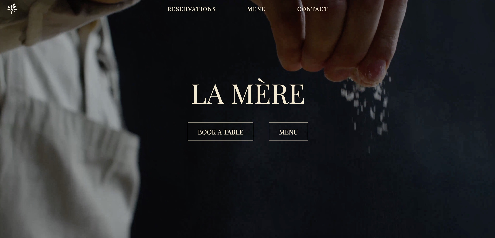
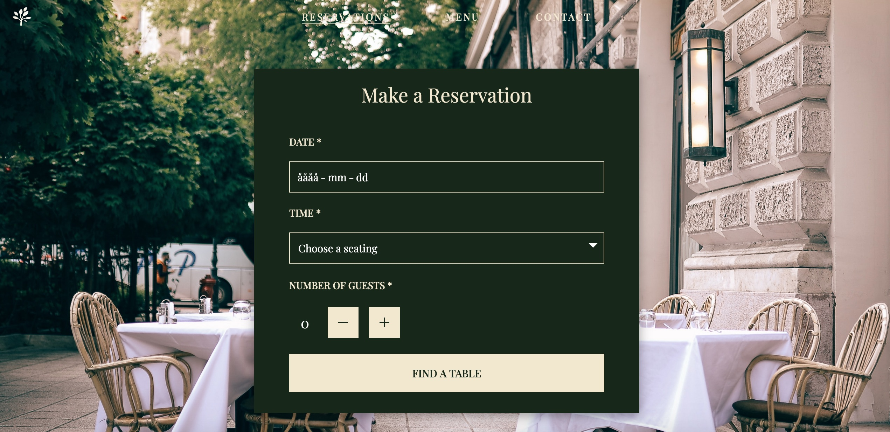
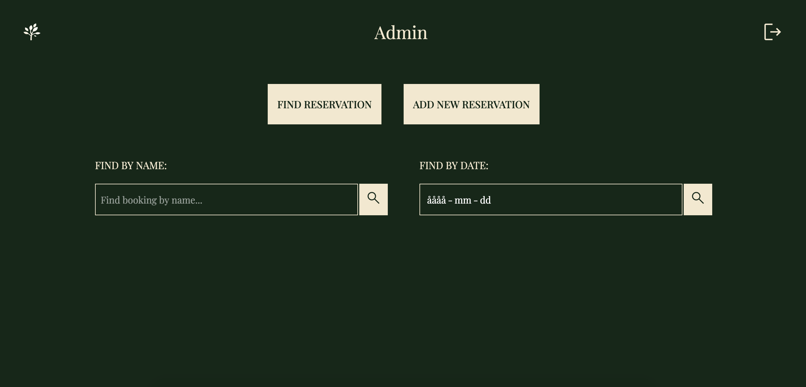
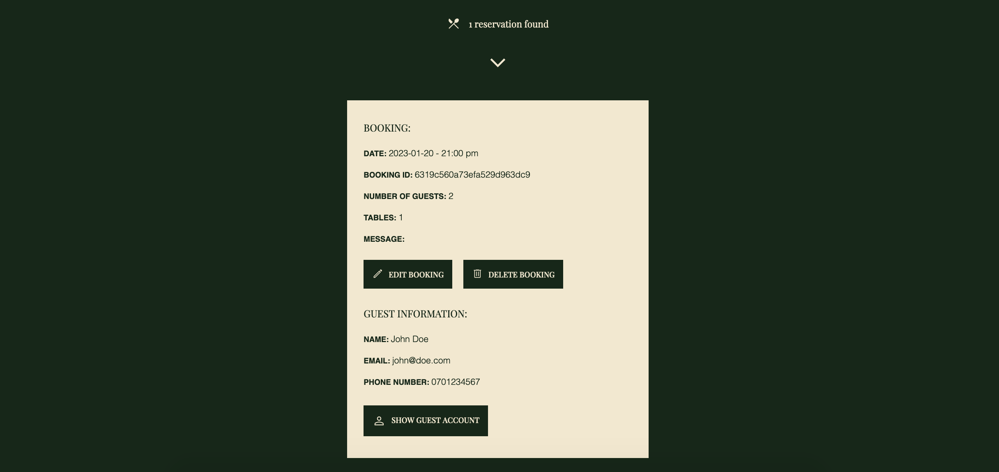

# Restaurant Booking App 📅 🍽️
Fullstack app using React, TypeScript and Styled components on the frontend and Node.js, Express and MongoDB on the backend.

## Table of contents
- [Overview](#overview)
- [Installation](#installation)
- [Testing with Cypress](#testing-with-cypress)
- [Email confirmation setup](#email-confirmation)
- [Access admin](#access-admin)
- [Login credentials](#login-credentials)
- [Screenshots](#screenshots)
- [Tools](#tools)

## Overview
This is a school project where we were tasked to create a restaurant website and booking system using React and TypeScript on the frontend and Node.js, Express and MongoDB on the backend. 

The restaurant has 15 tables in total, each table seating up to 6 guests. We created functionality to accommodate larger groups as well, so the booking system reserves the amount of tables needed. 

The project features full authentication for admin/staff who can log in and perform CRUD operations (access all bookings, add, edit and remove bookings). 

After you make an online reservation, you will receive an email confirmation along with a cancellation link. 

End-to-end tests were implemented using Cypress.

## Screenshots

## Tools
React\
TypeScript\
Sass\
MongoDb\
Node\
Mongoose\
Nodemailer\
Cypress

## Installation
1. Clone the repo\
`git clone https://github.com/19ozman/la_mere`

2. Install npm packages\
`npm i`

3. CD into repo\
`cd la_mere`

4. Create a .env file\
To run this application you'll need the following environment variables in a .env file in the backend folder:\
PORT=4000\
MONGO_URI=”your MongoDB connection string/LA_MERE”

5. Start server\
`cd backend`\
`npm run dev`

5. Run React \
Open a new terminal\
`cd frontend`\
`npm start`

## Testing with Cypress:
1. Open terminal and cd into root directory\
`cd ..`

2. Install NPM packages\
`npm install`

3. Start Cypress\
`npx cypress open`

## Email confirmation
1. Sign in or create a free Gmail account. In the Security tab, activate 2 step verification and create an app password:\
https://myaccount.google.com/security

2. Add the credentials (your email address and app password) to variables in your .env file:\
MAIL_USER=”Your email address”\
MAIL_PASS=”Your app password”

## Access admin

1. Make sure to use the file - `"admins.json"` - and import it to `MongoDB`.

2. File is located in - `backend/db/admins.json`

3. Connect to your `MongoDB`

5. In MongoDB client when connected:

`LA_MERE =>`

`Create collection =>`

`"admins" =>`

`"ADD DATA" =>`

`"Import File" =>`

`"admins.json"`

## Login Credentials

Login at `"http://localhost:3000/admin"`

Admin: `EMAIL: admin@admin.io` - `PASS: admin`

Employee: `EMAIL: user@user.io` - `PASS: user`

`localhost:4000/admin/manage` is `NOT` fully functional yet.

## Authors
[Malin Nilsson](https://github.com/malin-nilsson)\
[Oscar Welen](https://github.com/19ozman)\
[Michael Miikkulainen](https://github.com/michael-cwm)
